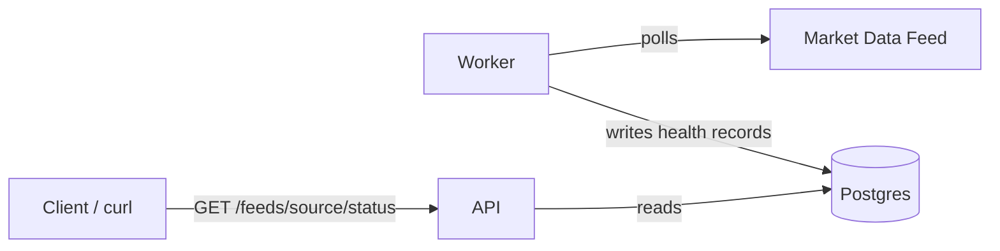

# Cluster-Radar


A Kubernetes learning project: a market data feed health/SLA monitor.

## What it does

A worker service polls market data feeds (starting with CoinGecko) on an
interval, measuring latency and detecting staleness. Results are stored in
Postgres. An API service exposes the latest status and history per feed
source.

## Why it exists

Built to learn real Kubernetes orchestration concepts using a genuine
multi-service system rather than a toy example — multiple replicas,
horizontal autoscaling, self-healing, and observability, applied to a
problem relevant to fintech infra: detecting when a data feed silently
degrades.

## Architecture



- **worker/** — polls configured feeds, writes health records to Postgres
- **api/** — FastAPI service, exposes `/health` and `/feeds/{source}/status`
- **Postgres** — stores feed health time-series

## Setup (local, via Docker Compose)

```bash
git clone <repo-url>
cd cluster-radar
docker compose up --build
```

This starts Postgres, the worker, and the API together. The worker waits
for Postgres to be healthy before connecting (see `docker-compose.yml`
healthcheck).

## Verify it's working

```bash
curl http://localhost:8000/health
curl http://localhost:8000/feeds/coingecko/status
curl http://localhost:8000/feeds/coingecko/history
```

## Deploying to Kubernetes (local, via kind)

Prereqs: `kind`, `kubectl`, Docker.

```bash
kind create cluster --name cluster-radar --config k8s/kind-config.yaml
cp k8s/manifests/secret.example.yaml k8s/manifests/secret.yaml
# edit secret.yaml with your own values, then:
./k8s/deploy.sh
```

Verify:
```bash
kubectl get pods -n cluster-radar
curl http://localhost:8000/health
curl http://localhost:8000/feeds/coingecko/status
```

## Status

**Phase 1 complete:** local multi-service app running via Docker Compose.

**Phase 2 complete:** migrated to Kubernetes — Deployments, Services, PVC
for Postgres, Secret + ConfigMap for config, liveness/readiness probes on
all three services, verified reproducible from a clean `kind` cluster via
`deploy.sh`.

**Next — Phase 3:** package as a Helm chart, add an HPA, and load-test
scaling behavior.