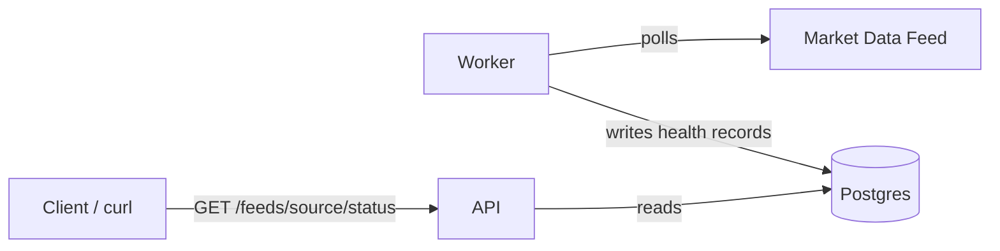

# Cluster-Radar


A Kubernetes learning project: a market data feed health/SLA monitor.

## What it does

A worker service polls market data feeds (starting with CoinGecko) on an
interval, measuring latency and detecting staleness. Results are stored in
Postgres. An API service exposes the latest status and history per feed
source.

## Why it exists

Built to learn real Kubernetes orchestration concepts using a genuine
multi-service system rather than a toy example — multiple replicas,
horizontal autoscaling, self-healing, and observability, applied to a
problem relevant to fintech infra: detecting when a data feed silently
degrades.

## Architecture



- **worker/** — polls configured feeds, writes health records to Postgres
- **api/** — FastAPI service, exposes `/health` and `/feeds/{source}/status`
- **Postgres** — stores feed health time-series
- **k8s/helm/cluster-radar/** — Helm chart for deploying the full stack

## Setup (local, via Docker Compose)

```bash
git clone <repo-url>
cd cluster-radar
docker compose up --build
```

This starts Postgres, the worker, and the API together. The worker waits
for Postgres to be healthy before connecting (see `docker-compose.yml`
healthcheck).

## Verify it's working

```bash
curl http://localhost:8000/health
curl http://localhost:8000/feeds/coingecko/status
curl http://localhost:8000/feeds/coingecko/history
```

## Deploying to Kubernetes (local, via kind + raw manifests)

Prereqs: `kind`, `kubectl`, Docker.

```bash
kind create cluster --name cluster-radar --config k8s/kind-config.yaml
cp k8s/manifests/secret.example.yaml k8s/manifests/secret.yaml
# edit secret.yaml with your own values, then:
./k8s/deploy.sh
```

Verify:
```bash
kubectl get pods -n cluster-radar
curl http://localhost:8000/health
curl http://localhost:8000/feeds/coingecko/status
```

## Deploying via Helm (recommended)

Prereqs: `kind`, `kubectl`, `helm`, Docker.

```bash
kind create cluster --name cluster-radar --config k8s/kind-config.yaml

cp k8s/manifests/secret.example.yaml k8s/manifests/secret.yaml
# edit secret.yaml with your own values, then:
kubectl apply -f k8s/manifests/secret.yaml

# metrics-server is required for the HPA to function
kubectl apply -f https://github.com/kubernetes-sigs/metrics-server/releases/latest/download/components.yaml
kubectl patch deployment metrics-server -n kube-system --type='json' \
  -p='[{"op": "add", "path": "/spec/template/spec/containers/0/args/-", "value": "--kubelet-insecure-tls"}]'

docker build -t cluster-radar-api:local ./api
docker build -t cluster-radar-worker:local ./worker
kind load docker-image cluster-radar-api:local --name cluster-radar
kind load docker-image cluster-radar-worker:local --name cluster-radar

helm install cluster-radar k8s/helm/cluster-radar -n cluster-radar --create-namespace
```

Verify:
```bash
kubectl get pods -n cluster-radar
kubectl get hpa -n cluster-radar
curl http://localhost:8000/health
```

Upgrade after making changes to the chart:
```bash
helm upgrade cluster-radar k8s/helm/cluster-radar -n cluster-radar
```

Uninstall:
```bash
helm uninstall cluster-radar -n cluster-radar
```

## Load testing & autoscaling verification

The API has a `HorizontalPodAutoscaler` targeting 50% CPU utilization
(1-5 replicas). Verified using `hey` to generate sustained load:

```bash
hey -z 3m -c 50 http://localhost:8000/feeds/coingecko/status
```

While watching scaling behavior live:
```bash
kubectl get hpa -n cluster-radar --watch
kubectl get pods -n cluster-radar --watch
```

Observed scaling behavior:

NAME REFERENCE TARGETS MINPODS MAXPODS REPLICAS AGE

api-hpa Deployment/api cpu: 8%/50% 1 5 5 4m32s

api-hpa Deployment/api cpu: 29%/50% 1 5 5 4m47s

api-hpa Deployment/api cpu: 110%/50% 1 5 5 4m29s

api-hpa Deployment/api cpu: 202%/50% 1 5 5 5m2s


Under sustained load from 50 concurrent workers, CPU utilization
exceeded the 50% target and the HPA scaled the API deployment from 1
to 5 replicas (the configured maximum) within under 5 minutes. All 5
API pods reached `Running` and `1/1` ready. Replicas scale back down
to 1 automatically after load stops and the default cooldown window
passes.


## Status

**Phase 1 complete:** local multi-service app running via Docker Compose.

**Phase 2 complete:** migrated to Kubernetes — Deployments, Services, PVC
for Postgres, Secret + ConfigMap for config, liveness/readiness probes on
all three services, verified reproducible from a clean `kind` cluster via
`deploy.sh`.

**Phase 3 complete:** packaged as a Helm chart, added resource requests/
limits, an HPA for the API, installed `metrics-server` on `kind`, and
verified real autoscaling behavior under load with `hey`.

**Next — Phase 4:** provision a managed cluster (GKE or EKS) via
Terraform, add Prometheus/Grafana observability, and wire up GitHub
Actions CI/CD.

## Notes / known gaps

- Staleness is currently detected by comparing consecutive price values —
  CoinGecko doesn't expose a clean "last updated" timestamp, so
  `seconds_since_update` is not yet populated.
- Only one feed source (CoinGecko) is wired up so far; more sources will
  be added once the k8s deployment pattern is proven.
- `k8s/manifests/` (raw manifests) and `k8s/helm/` (Helm chart) currently
  overlap in purpose — the raw manifests are kept for reference/learning,
  but the Helm chart is the recommended deployment path going forward.